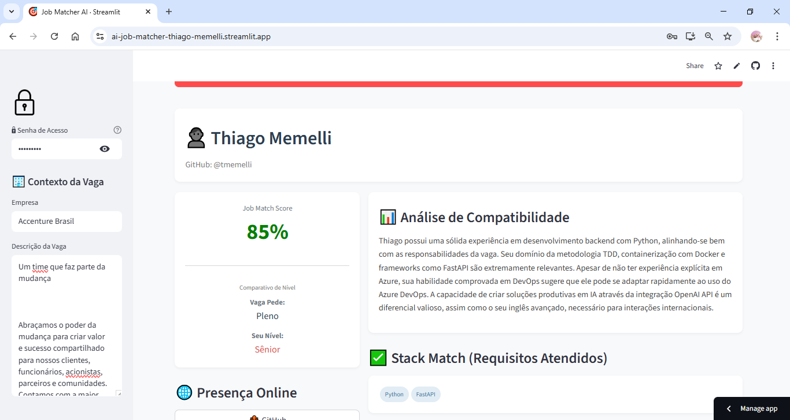
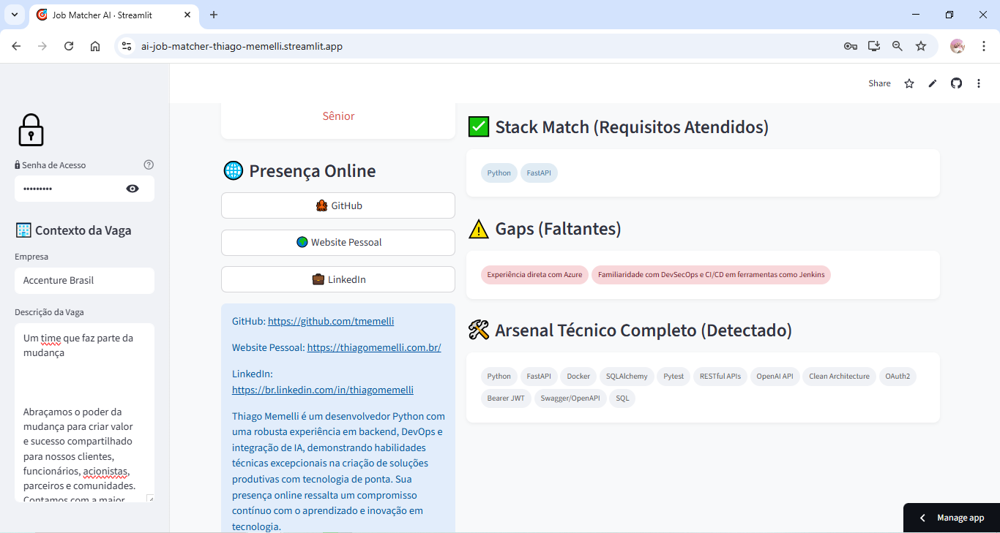
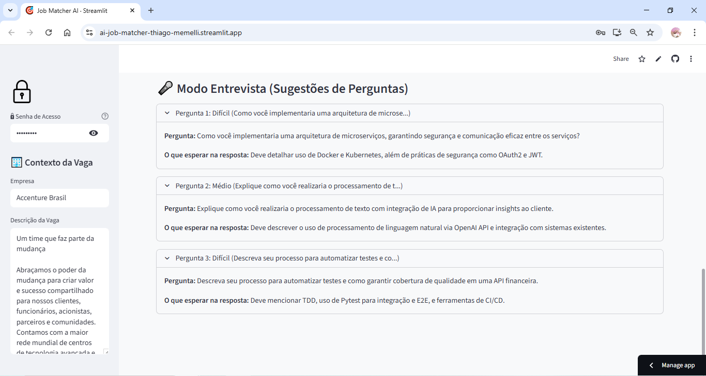
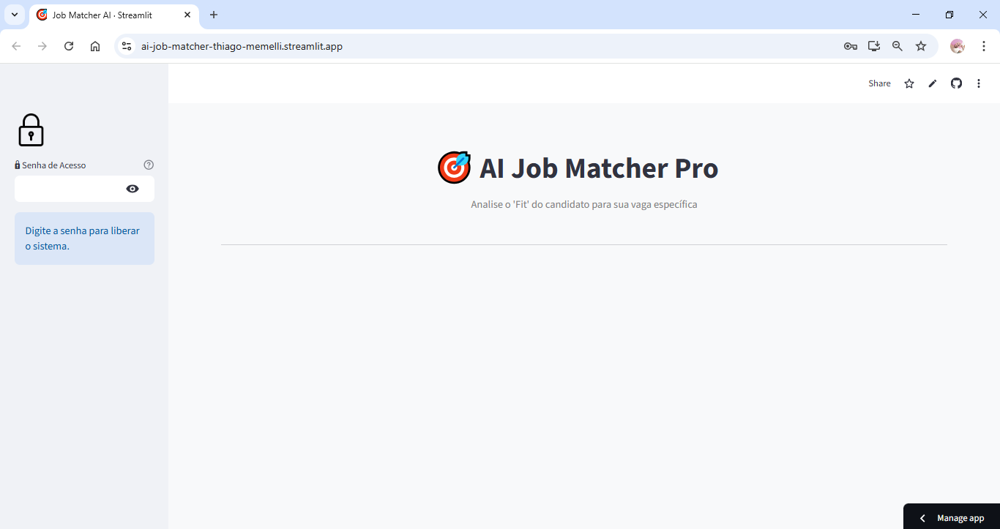

<div align="center">

# 🎯 AI Job Matcher Pro

### Agente Autônomo de Recrutamento com Inteligência Artificial

<br>

[](https://python.org)
[](https://openai.com)
[](https://streamlit.io)
[](https://pydantic.dev)

<br>

[](https://github.com/tmemelli/ai-job-matcher/actions)
[](LICENSE)
[](http://makeapullrequest.com)

<br>

**Um recrutador sênior digital que não apenas lê currículos — ele investiga, valida e prepara entrevistas.**

[Demonstração](#️-demonstração-da-aplicação) •
[Instalação](#-instalação) •
[Arquitetura](#️-arquitetura) •
[Escalabilidade](#-escalabilidade--arquitetura-de-plugins) •
[Roadmap](#️-roadmap)

</div>

> **🔐 Credenciais de Acesso (Live Demo):**
### 🔴 [CLIQUE AQUI PARA TESTAR AO VIVO](https://ai-job-matcher-thiago-memelli.streamlit.app) 🔴
**(Senha de Acesso: `visitante`)**

---

## 💡 O Problema

Recrutadores gastam em média **23 horas por semana** triturando currículos. A maioria das ferramentas de ATS apenas faz *keyword matching* — uma abordagem rasa que falha em:

- **Distinguir Senioridade:** Um "Sênior" em Data Science pode ser "Júnior" em DevOps.
- **Validar Presença:** Não verificam se o GitHub ou Portfólio citados realmente sustentam o que está no PDF.
- **Contexto:** Perdem candidatos ótimos que usam sinônimos para as tecnologias pedidas.

---

## 🚀 A Solução

O **AI Job Matcher Pro** opera como um agente autônomo com múltiplas ferramentas. Ele não apenas analisa — ele **investiga ativamente**:

```
┌─────────────────────────────────────────────────────────────────────────────┐
│                                                                             │
│   📄 CV (PDF)  ──►  🤖 AGENTE  ──►  🔍 GitHub API  ──►  🌐 Web Search      │
│                         │                                                   │
│                         ▼                                                   │
│              ┌──────────────────────┐                                       │
│              │   GPT-4o Analysis    │                                       │
│              │  • Match Score       │                                       │
│              │  • Gap Analysis      │                                       │
│              │  • Seniority Check   │                                       │
│              │  • Interview Prep    │                                       │
│              └──────────────────────┘                                       │
│                         │                                                   │
│                         ▼                                                   │
│              📊 Relatório Executivo                                         │
│                                                                             │
└─────────────────────────────────────────────────────────────────────────────┘
```

---

## ✨ Features

### 🎯 Match Score Contextual
Vai além de keywords. Analisa **contexto semântico** entre requisitos da vaga e experiência real do candidato.

### 🔬 Validação Multi-Source
```python
# O agente executa automaticamente:
github_data = fetch_github_profile(username)     # Repos, stars, linguagens
web_results = search_candidate_online(name)      # LinkedIn, artigos, portfólio
```

### 📊 Análise de Senioridade Contextual
> **Insight crítico:** Um Arquiteto de Software Sênior aplicando para Chef de Cozinha é um **iniciante** naquela vaga.

O sistema distingue:
- `job_required_seniority` — O que a vaga pede
- `candidate_seniority_for_job` — Nível real do candidato **para aquela posição específica**

### 🎤 Gerador de Entrevistas
Cria perguntas técnicas e comportamentais personalizadas baseadas nos **gaps identificados**:

```python
class InterviewQuestion(BaseModel):
    question: str                    # A pergunta
    expected_answer_topic: str       # O que esperar na resposta
    difficulty: str                  # Fácil | Médio | Difícil
```

### 🛡️ Arsenal Técnico Completo
Detecta **todas** as tecnologias do candidato, não apenas as que a vaga pede — útil para descobrir potencial oculto.

---

## 🖼️ Demonstração da Aplicação

Visão geral das principais funcionalidades do sistema:

<div align="center">

| Dashboard Executivo | Análise de Gaps |
|:---:|:---:|
|  |  |
| *Score de compatibilidade e comparativo de senioridade* | *Identificação visual de skills faltantes* |

| Modo Entrevista | Acesso Seguro |
|:---:|:---:|
|  |  |
| *Perguntas técnicas geradas por IA com dificuldade* | *Controle de acesso para recrutadores* |

</div>

---

## 🧪 Estudo de Caso Real: Vaga ilegra vs. Candidato

Para validar a precisão do agente, submetemos o sistema a um teste cego com uma vaga real e competitiva.

**1. O Cenário (Vaga LinkedIn)**
* **Empresa:** ilegra
* **Cargo:** Python Developer (Sênior)
* **Stack Exigida:** Python, AWS (Lambda, DynamoDB), Docker, Terraform.

**2. A Análise do Agente**
O sistema processou o currículo contra a vaga e gerou os seguintes insights:

* **✅ Match Score: 85%**
    * O agente identificou uma alta compatibilidade. Diferente de um ATS comum que poderia descartar o candidato por falta de palavras-chave exatas de infraestrutura, a IA entendeu que a base sólida de Engenharia de Software (Clean Arch, TDD, SOLID) sustentava o nível **Sênior**.
* **🎯 Validação de Senioridade**
    * **Vaga Pede:** Sênior
    * **Candidato:** Validado como **Sênior** pelo agente (não houve rebaixamento de nível, apesar dos gaps).
* **⚠️ Identificação de Gaps Precisos**
    * O sistema alertou especificamente: *"Falta experiência explícita com AWS (Lambda, API Gateway, DynamoDB)"* e *"Forte vivência com Terraform"*. Isso direciona o recrutador para investigar o quanto o candidato estaria disposto a aprender essas ferramentas.
* **🎤 Perguntas Geradas**
    * Para mitigar o risco, o agente gerou uma pergunta técnica difícil sobre *"Desafios em projetos Serverless"*, permitindo validar se o candidato tem conceitos teóricos mesmo sem a prática da ferramenta específica.

---

## 🔌 Escalabilidade & Arquitetura de Plugins

> **Nota de Engenharia:** Este projeto foi desenvolvido intencionalmente para o setor de **Tecnologia**, utilizando ferramentas como GitHub API para validação de perfis de desenvolvedores. No entanto, a arquitetura foi pensada para ser **extensível e escalável** para qualquer setor.

### Por que funciona para TI hoje?

O agente utiliza **tools plugáveis** que podem ser substituídas conforme o domínio:

```python
# Configuração atual (Desenvolvedores)
tools = [
    GitHubTool(),        # Valida repositórios e contribuições
    TavilySearchTool(),  # Busca LinkedIn, artigos, portfólio
]
```

### Como escalar para outros setores?

A análise via LLM (GPT-4o) é **genérica** — funciona para qualquer profissão. O que muda são as **ferramentas de validação externa**:

```python
# Exemplo: Setor de Saúde (Médicos, Enfermeiros)
tools = [
    CRMTool(),           # Validação no Conselho Regional de Medicina
    LattesTool(),        # Currículo Lattes (publicações, especializações)
    PubMedTool(),        # Artigos científicos publicados
    LinkedInTool(),      # Presença profissional
]

# Exemplo: Setor Jurídico (Advogados)
tools = [
    OABTool(),           # Validação na Ordem dos Advogados do Brasil
    JusBrasilTool(),     # Casos e jurisprudência
    LinkedInTool(),      # Networking profissional
]

# Exemplo: Setor Acadêmico (Professores, Pesquisadores)
tools = [
    LattesTool(),        # Currículo Lattes completo
    GoogleScholarTool(), # Índice H, citações, publicações
    ORCIDTool(),         # Identificador de pesquisador
]

# Exemplo: Setor Criativo (Designers, Artistas)
tools = [
    BehanceTool(),       # Portfólio de design
    DribbbleTool(),      # Trabalhos visuais
    InstagramTool(),     # Presença e engajamento
]
```

### Arquitetura Proposta para v2.0

```
┌───────────────────────────────────────────────────────────────────┐
│                     🧠 CORE ENGINE (Genérico)                     │
│   ┌─────────────┐  ┌─────────────┐  ┌─────────────────────────┐   │
│   │ PDF Parser  │  │ LLM Analysis│  │ Structured Output       │   │
│   │ (pypdf)     │  │ (GPT-4o)    │  │ (Pydantic)              │   │
│   └─────────────┘  └─────────────┘  └─────────────────────────┘   │
└───────────────────────────────────────────────────────────────────┘
                              │
                              ▼
┌───────────────────────────────────────────────────────────────────┐
│                 🔌 PLUGIN LAYER (Por Setor)                       │
│  ┌──────────┐  ┌───────────┐  ┌───────────┐  ┌──────────────────┐ │
│  │ TechTools│  │HealthTools│  │ LegalTools│  │ AcademicTools    │ │
│  │ • GitHub │  │ • CRM     │  │ • OAB     │  │ • Lattes         │ │
│  │ • Stack  │  │ • Lattes  │  │ • JusBr   │  │ • Scholar        │ │
│  └──────────┘  └───────────┘  └───────────┘  └──────────────────┘ │
└───────────────────────────────────────────────────────────────────┘
```

### Benefícios desta Arquitetura

| Aspecto | Benefício |
|---------|-----------|
| **Manutenibilidade** | Adicionar novo setor = criar novo plugin |
| **Testabilidade** | Cada tool pode ser testada isoladamente |
| **Flexibilidade** | Cliente escolhe quais tools ativar |
| **Custo** | Paga apenas pelas APIs que usar |

> 💡 **Para recrutadores:** Este projeto demonstra não apenas habilidade técnica, mas **pensamento de produto** — a capacidade de criar soluções que escalam além do MVP inicial.

---

## 🛠️ Stack Tecnológica

| Camada | Tecnologia | Propósito |
|--------|------------|-----------|
| **LLM** | OpenAI GPT-4o | Análise contextual e geração de insights |
| **Validação** | Pydantic v2 | Structured Outputs com type safety |
| **Interface** | Streamlit | Dashboard interativo |
| **Web Search** | Tavily + DuckDuckGo | Busca web com fallback automático |
| **APIs** | GitHub REST API | Análise de repositórios e atividade |
| **PDF** | pypdf | Extração de texto de currículos |
| **CI/CD** | GitHub Actions | Testes automatizados a cada push |

---

## 📦 Instalação

### Pré-requisitos

- Python 3.11+
- Chave de API da OpenAI

### Quick Start

```bash
# 1. Clone o repositório
git clone https://github.com/tmemelli/ai-job-matcher.git
cd ai-job-matcher

# 2. Crie e ative o ambiente virtual
python -m venv venv
source venv/bin/activate  # Linux/Mac
# ou: .\venv\Scripts\activate  # Windows

# 3. Instale as dependências
pip install -r requirements.txt

# 4. Configure as variáveis de ambiente
cp .env.example .env
# Edite o .env com suas credenciais
```

### Configuração do `.env`

```env
# Obrigatório
OPENAI_API_KEY=sk-your-key-here

# Opcional: modelo (default: gpt-4o-2024-08-06)
OPENAI_MODEL=gpt-4o-2024-08-06

# Senha de acesso ao dashboard
APP_PASSWORD=sua-senha-aqui

# Opcional: chave API Tavily para busca web otimizada (fallback para DuckDuckGo)
TAVILY_API_KEY=tvly-your-key-here
```

### Executar

```bash
streamlit run src/app.py
```

Acesse: `http://localhost:8501`

---

## 🏗️ Arquitetura

```
ai-job-matcher/
│
├── 📂 .github/
│   └── workflows/
│       └── ci.yml              # Pipeline CI/CD com testes automatizados
│
├── 📂 src/
│   ├── __init__.py             # Marca o diretório como pacote Python
│   ├── agent.py                # 🧠 Cérebro: orquestração LLM + tools
│   ├── tools.py                # 🔧 Ferramentas: GitHub API + Web Search
│   └── app.py                  # 🖥️ Interface: Dashboard Streamlit
│
├── 📂 assets/                 # Screenshots para documentação
│   ├── dashboard.png           # Tela principal com score e senioridade
│   ├── gaps.png                # Visualização de skills faltantes
│   ├── interview.png           # Perguntas de entrevista geradas
│   ├── login.png               # Tela de autenticação
│   ├── setup.png               # Configuração inicial do sistema
│   ├── vaga-descricao.png      # Exemplo de descrição de vaga
│   └── vaga-titulo.png         # Exemplo de título de vaga
│
├── 📂 data/
│   └── resume.pdf              # CV de exemplo para testes
│
├── .env.example                # Template de variáveis de ambiente
├── .gitignore                  # Arquivos ignorados pelo Git
├── LICENSE                     # Licença MIT
├── requirements.txt            # Dependências Python
└── README.md                   # Esta documentação
```

### Fluxo de Dados

```
┌────────────┐     ┌────────────┐     ┌────────────┐
│   app.py   │────►│  agent.py  │────►│  tools.py  │
│            │     │            │     │            │
│ • Upload   │     │ • Extract  │     │ • GitHub   │
│ • Display  │     │ • Analyze  │     │ • Search   │
│ • Interact │     │ • Generate │     │            │
└────────────┘     └────────────┘     └────────────┘
      │                  │                  │
      │                  ▼                  │
      │           ┌────────────┐            │
      │           │  OpenAI    │            │
      └──────────►│  GPT-4o    │◄───────────┘
                  │            │
                  │ Structured │
                  │  Outputs   │
                  └────────────┘
```

---

## 🔍 Como Funciona

### 1. Extração de Identidade
```python
# Fase 1: GPT-4o-mini extrai nome e GitHub do CV
identity = {"name": "João Silva", "github": "joaosilva"}
```

### 2. Coleta Multi-Source
```python
# Fase 2: Tools buscam dados externos
github_data = fetch_github_profile("joaosilva")
web_data = search_candidate_online("João Silva")
```

### 3. Análise Contextual Profunda
```python
# Fase 3: GPT-4o analisa tudo com Structured Outputs
result: CandidateAnalysis = analyze_candidate_with_tools(
    cv_text=cv,
    job_description=job,
    company_name="TechCorp"
)
```

### 4. Output Estruturado
```python
class CandidateAnalysis(BaseModel):
    candidate_name: str
    github_username: Optional[str]
    match_score: int                      # 0-100
    match_analysis: str
    missing_skills: List[str]
    detected_hard_skills: List[str]       # Arsenal completo
    job_required_seniority: str
    candidate_seniority_for_job: str      # Contextual!
    web_presence_analysis: str
    interview_questions: List[InterviewQuestion]
    skills: SkillSet
```

---

## 🧪 Testes e CI/CD

O projeto usa GitHub Actions para garantir qualidade a cada commit:

```yaml
# .github/workflows/ci.yml - Testes executados automaticamente
- Verificar imports dos módulos
- Verificar sintaxe Python (py_compile)
- Testar extração de PDF
- Testar conexão com GitHub API
```

**Status atual:** [](https://github.com/tmemelli/ai-job-matcher/actions)

---

## 🗺️ Roadmap

### v1.0 ✅ (Atual)
- [x] Análise de CV via GPT-4o com Structured Outputs
- [x] Integração GitHub API para validação de perfil
- [x] Web Search com fallback (Tavily → DuckDuckGo)
- [x] Gerador de perguntas de entrevista personalizadas
- [x] Dashboard interativo em Streamlit
- [x] CI/CD com GitHub Actions
- [x] Documentação completa com estudo de caso

### v1.1 🔜 (Próximo)
- [ ] Análise em lote (múltiplos candidatos)
- [ ] Export PDF do relatório executivo
- [ ] Histórico de análises (SQLite)
- [ ] Rate limiting inteligente para APIs
- [ ] Cache de resultados
- [ ] GitHub Token para aumentar rate limit (60 → 5.000 req/hora)


### v2.0 🚀 (Futuro)
- [ ] **Arquitetura de Plugins** para outros setores
- [ ] RAG com base de vagas anteriores
- [ ] Integração LinkedIn API (OAuth)
- [ ] Multi-tenant com autenticação
- [ ] API REST para integrações
- [ ] Deploy em cloud (Railway/Render)

---

## 🤝 Contribuindo

Contribuições são bem-vindas! Por favor:

1. Fork o projeto
2. Crie sua branch (`git checkout -b feature/NovaFeature`)
3. Commit suas mudanças (`git commit -m 'Add: nova feature'`)
4. Push para a branch (`git push origin feature/NovaFeature`)
5. Abra um Pull Request

---

## 📄 Licença

Distribuído sob a licença MIT. Veja [LICENSE](LICENSE) para mais informações.

---

## 🙏 Agradecimentos

- **OpenAI** — Pelos modelos GPT-4o que dão inteligência ao agente
- **Streamlit** — Pela capacidade de criar dashboards em minutos
- **Pydantic** — Pela validação rigorosa e Structured Outputs
- **Tavily** — Pela API de busca otimizada para agentes de IA
- **pypdf** — Pela extração eficiente de texto de PDFs

---

## 📞 Contato & Oportunidades

Se você é um **recrutador** ou **hiring manager** procurando um desenvolvedor que une **Engenharia de Software** com **Inteligência Artificial**:

<div align="center">

| Canal | Contato |
|-------|---------|
| 📧 **Email** | [tmemelli@gmail.com](mailto:tmemelli@gmail.com) |
| 💼 **LinkedIn** | [linkedin.com/in/thiagomemelli](https://www.linkedin.com/in/thiagomemelli/) |
| 🐙 **GitHub** | [github.com/tmemelli](https://github.com/tmemelli) |
| 🌐 **Portfolio** | [thiagomemelli.com.br](https://thiagomemelli.com.br/) |
| 📱 **WhatsApp** | [+55 27 98903-0474](https://wa.me/5527989030474) |

</div>

### Estou disponível para:

- 🤖 Posições de **AI Engineer** & **Backend Python**
- 🔧 Desenvolvimento de **Agentes Autônomos** (RAG, Function Calling, Multi-Agent)
- ⚡ **Automação de Processos** com Inteligência Artificial
- 💡 Consultoria em **Integração de LLMs** em produtos existentes
- 🌎 Oportunidades **Brasil ou Exterior** (Remoto)

---

<div align="center">

### ⭐ Se este projeto demonstrou valor, considere dar uma estrela!

**Desenvolvido com 🧡 e Inteligência Artificial por [Thiago Memelli](https://github.com/tmemelli)**

*Projeto de Agente Autônomo — Dezembro 2025*

[](https://github.com/tmemelli/ai-job-matcher)

</div>
